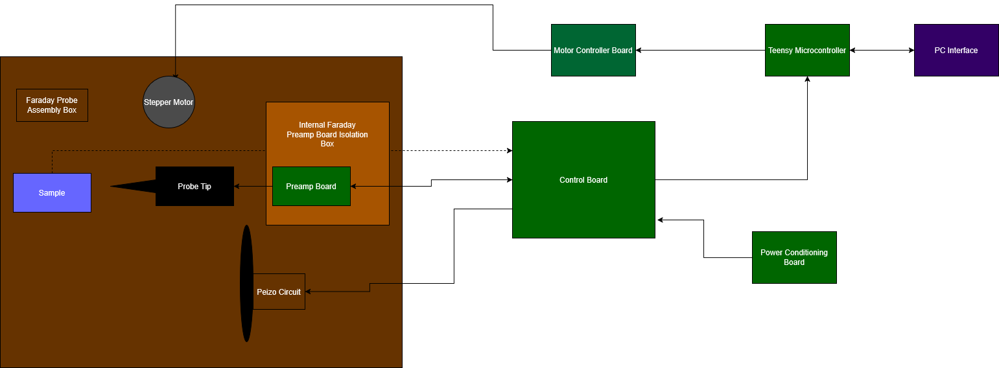
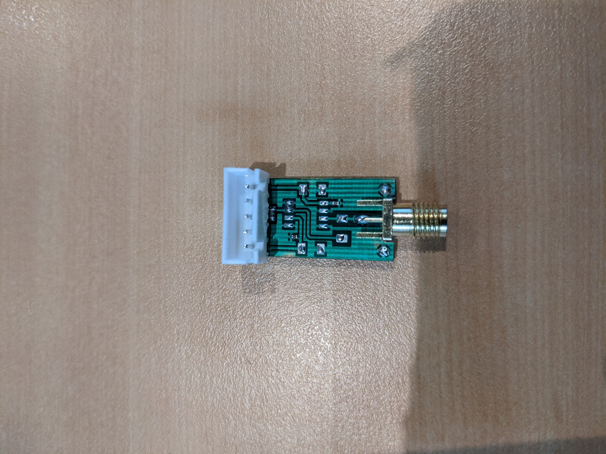
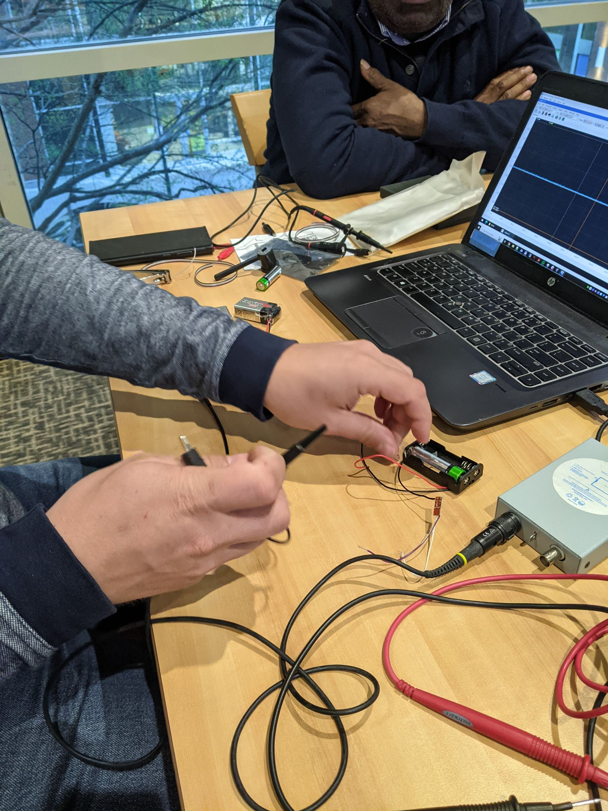
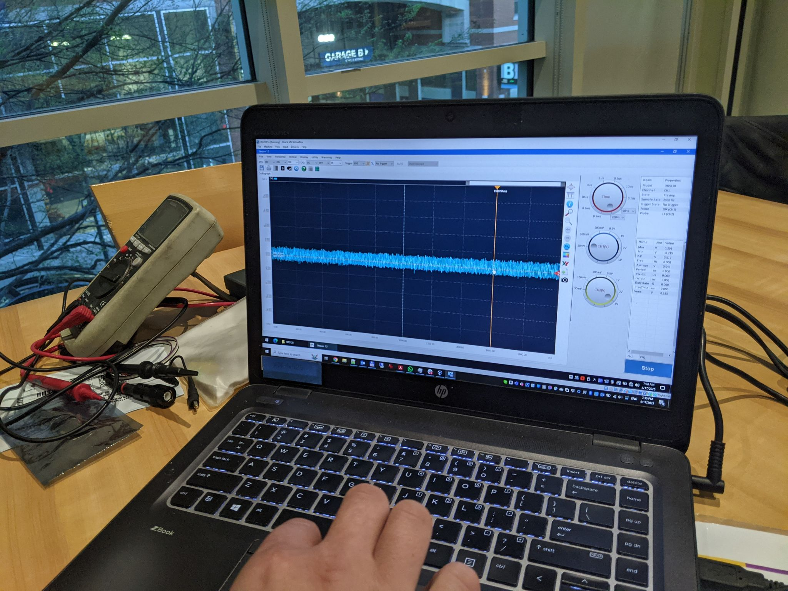
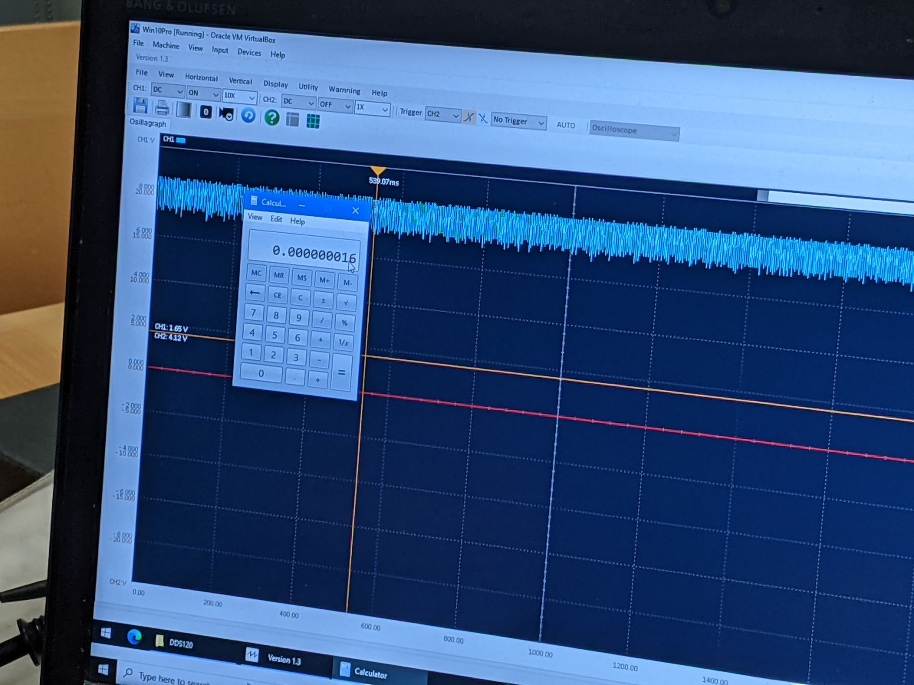
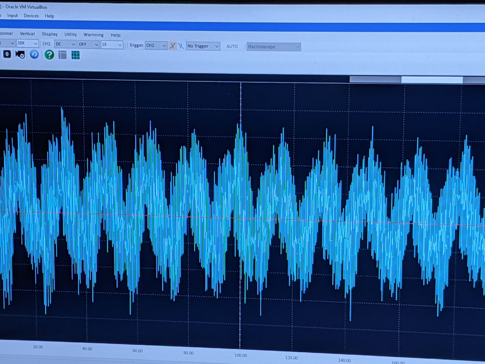
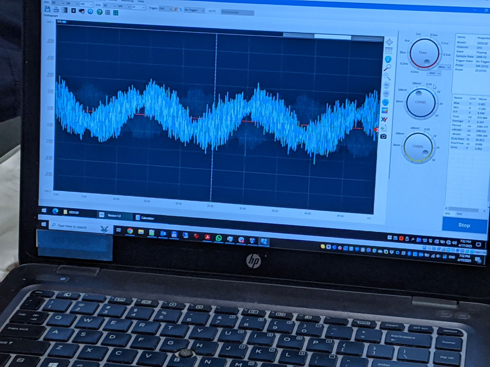
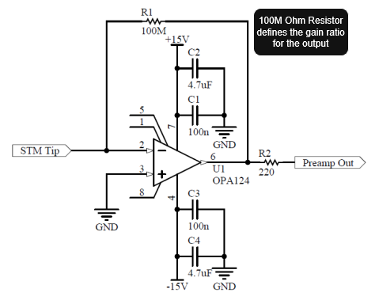
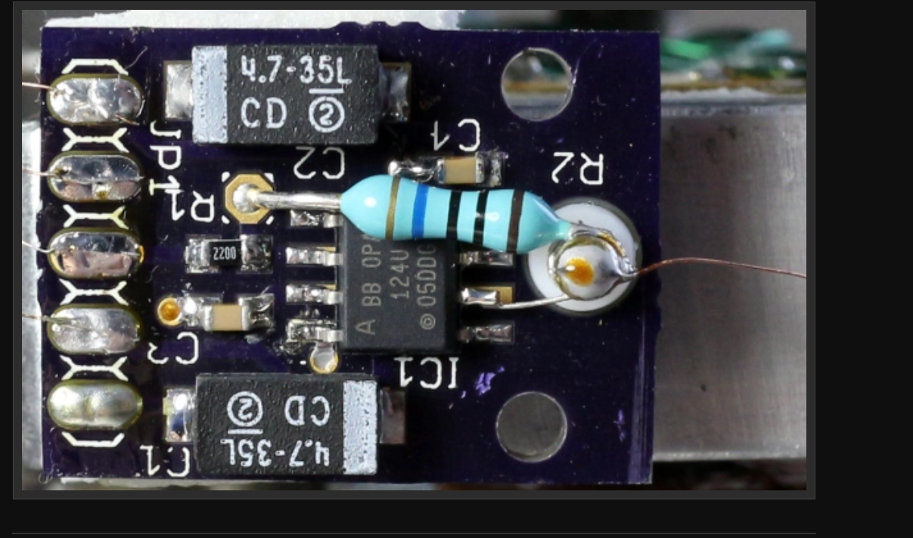
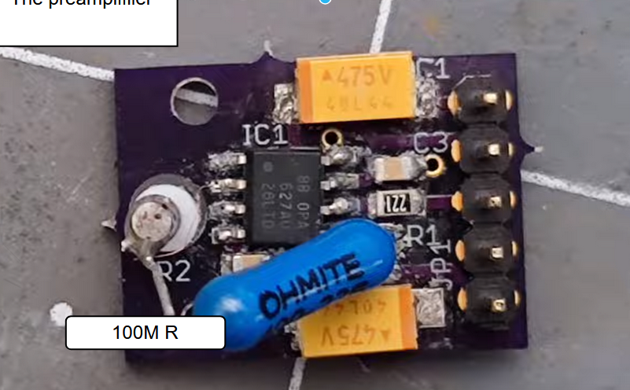

# Preamplifier Board (2.A)

## Overview

The preamplifier circuit is one of several circuit boards in the STM electronics system. The electrical probe (sense wire) connects directly to this board, which amplifies the tunneling current before the signal leaves the Faraday cage and is sent to the control board and microcontroller.

The sense wire from the probe tip is electrically connected directly to the preamp board and is the primary sensor input for the system.

**CAD and design:** The PreAmp board CAD is maintained in Easy EDA. (Design conversion and shareable link to be published by the team.)

---

## Circuit Configuration: Transimpedance Amplifier

The preamp is configured as a **transimpedance amplifier**, converting the small tunneling current from the tip into a measurable voltage. This topology is standard for STM current sensing because it provides high gain and well-defined bandwidth for picoampere-level signals.

*(Additional theory and transfer function description can be added here when the design is finalized.)*

---

## Physical Board and Schematic

Our preamplifier prototype is shown below. A version 2 of this design is in development.

**Schematic:** *(Schematic image to be added from design files.)*

### Bill of Materials (BOM) and Component Roles

- **1× OpAmp IC (e.g. OPA____)** — Core amplification; choice of part affects noise and bandwidth.
- *(Additional components and purposes to be documented from the schematic.)*

**OpAmp selection:** The design was updated to a modern OpAmp (e.g. OPA___) for improved noise and bandwidth. *(Specific part number and rationale to be confirmed with the design owner.)*

---

## Design Considerations for Low Noise

Higher sensitivity improves signal detection but also increases susceptibility to noise. Robust electromagnetic isolation is important. Recommended design and assembly practices:

- **Sense wire length:** As short as possible to reduce antenna pickup.
- **Shielding:** Shielded for as long as possible; keep unshielded runs minimal.
- **Environment:** Operate inside an isolated environment (e.g. Faraday cage).
- **Junctions:** Use highly conductive, non-oxidized connections; ensure components are well seated or well soldered.

**Shielded SMA cable:** A shielded SMA cable was introduced to improve noise performance. *(A high-quality annotated photo of the preamp with SMA cable can be added with the team.)*

---

## Noise Demonstration and Oscilloscope Results

The following figures illustrate baseline noise and the effect of improvements. The test setup used the OpAmp board (small red board) powered from a battery, with an oscilloscope and PC recording the preamp output.

**Reference material:** Additional photos and notes from the preamp noise demo are in Google Drive (e.g. `QT Panda\Pictures\Preamp Noise Demo`). *(Interview with the design owner can clarify what each photo shows and what was changed to reduce noise.)*

**Links:**
- [PreAmp video / discussion](https://drive.google.com/file/d/1hix7r5ol7p9WjFohcujht9YvlXSEAAQE/view?usp=sharing)
- [Related drive links](https://drive.google.com/file/d/1BSD5sYQINcGNepSOVig8N9QWcB46_IWH/view?usp=sharing)  
- [Additional reference](https://drive.google.com/file/d/11My-qS9u0YO_B5ZXZEPDObcXX4wG_B6d/view?usp=sharing)

---

## Comparison with Dan's and MechPanda's Designs

Both reference designs use a **100 MΩ resistor** to set the transimpedance gain. The following figures show their implementations alongside our board.

**Dan's design — circuit and board:**

**MechPanda's preamp:**

---

## See Also

- [PreAmp (main reference)](../preamp.md) — Transimpedance concepts, sense-wire guidelines, and component links.
- [PREAMP.md](../PREAMP.md) — Project-level preamp overview and references.
