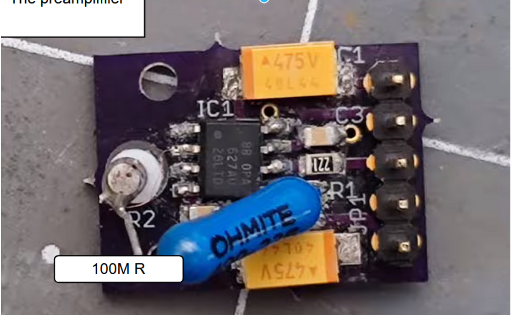
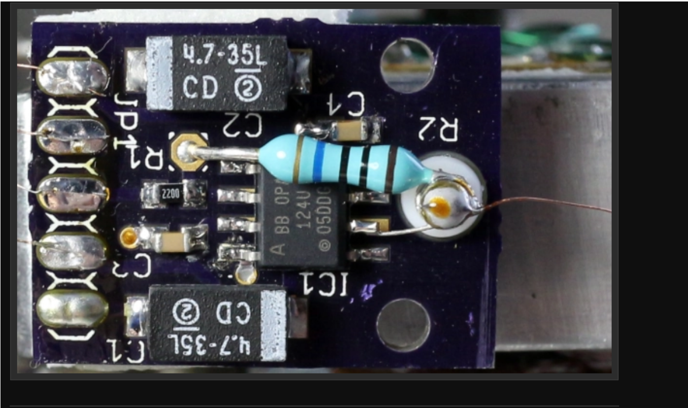

# PreAmp Documentation

## Overview

The PreAmp (Transimpedance Amplifier) is a critical component that allows conversion of small current changes into high voltage signals.

**Reference Video:** [PreAmp and Z-controller boards discussion](https://drive.google.com/file/d/1hix7r5ol7p9WjFohcujht9YvlXSEAAQE/view?usp=sharing)

## Key Concepts

### Transimpedance Amplifier
- Converts small current changes into high voltage signals
- Essential for precise signal amplification in the system

### Impedance in DC Circuits
In DC conditions, impedance simplifies to resistance. Capacitors act as open circuits (no current flow), and inductors act as short circuits after transient responses settle. Only resistance matters in DC conditions.

## Design Considerations

### Resistor Placement

The 100M ohm Ohmite resistor is suspended above the board to prevent current leaks through the PCB surface.

### OpAmp Sense Wire Configuration

Historically, the OpAmp sense wire (negative input pin) is manually lifted off the PCB and soldered to a post that holds the probe tip wire. This post may also connect to one end of the main gain resistor.

### Ideal Input Sense Wire Parameters
- **Length:** As short as possible to minimize antenna effects
- **Shielding:** Shielded for as long as possible to reduce antenna effects
- **Environment:** Should be in an isolated environment (Faraday cage)

### Potential Improvements
- **Shielded SMA Cable:** Could be used, but impedance considerations apply
  - Signal reflections depend on the chip bandwidth and frequency
  - Spencer notes it depends on the chip bandwidth

### Connection Requirements
The connection to the pin socket must be both mechanical and electrical. It must remain secure and conductive even under vibration or movement.

**Important Note:** Component tolerance matters significantly—don't compromise on quality here.

### Piezo Wire Considerations
The movement of the piezo must experience negligible torque from the wire; otherwise, positional data will be inaccurate.

## Feedback Circuits

Feedback circuits with OpAmps provide near-immediate response times, which is significantly faster than sending signals to a microcontroller.

**Design Comparison:**
- **Dan's Design:** Uses feedback circuit for locking of the piezo Z-axis (high speed)
- **MechPanda:** Used feedback through the microcontroller

## Component Specifications

### Control Board OpAmps
- **3x** [Texas Instruments OPA2227P](https://www.lcsc.com/product-detail/Precision-Op-Amps_Texas-Instruments-OPA2227P_C1346534.html)
- **1x** [Analog Devices LT1469IN8-PBF](https://www.lcsc.com/product-detail/Operational-Amplifier_Analog-Devices-LT1469IN8-PBF_C663979.html)

### Pin Connector Options
- [Molex FCT 172704-0152](https://www.mouser.com/ProductDetail/Molex-FCT/172704-0152?qs=Fg5TsMy7H4sQV9EpViPhJQ%3D%3D&mgh=1&gQT=1)
- [TE Connectivity 204351-1](https://www.digikey.com/en/products/detail/te-connectivity-aerospace-defense-and-marine/204351-1/299512)

## Additional Resources
- [Home-built STM Electronics Reference](https://dberard.com/home-built-stm/electronics1/)

